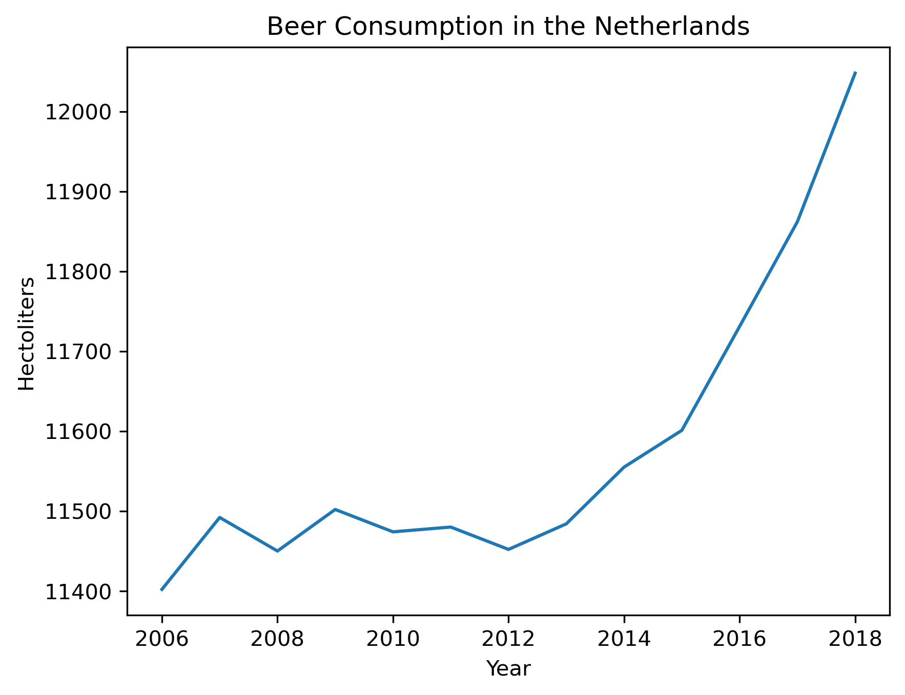

16461703

MCC Van Dyke et al., 2019 - Fantastic yeasts and where to find them: the hidden diversity of dimorphic fungal pathogens

JT Harvey, Applied Ergonomics, 2002 - An analysis of the forces required to drag sheep over various surfaces

DW Ziegler et al., 2005 - The neurocognitive effects of alcohol on adolescents and college students

I find this chart very interesting for two major reasons, first is the lack of major spike in drinking around 2008 which is strange given the financial crisis. I supposed Dutch people developed healthier coping mechanisms (wouldn't be me). The second is the large and sustained increase in drinking beginning around 2012. My only though is that it is a delayed reaction to the 2010 FiFa world cup final loss.

